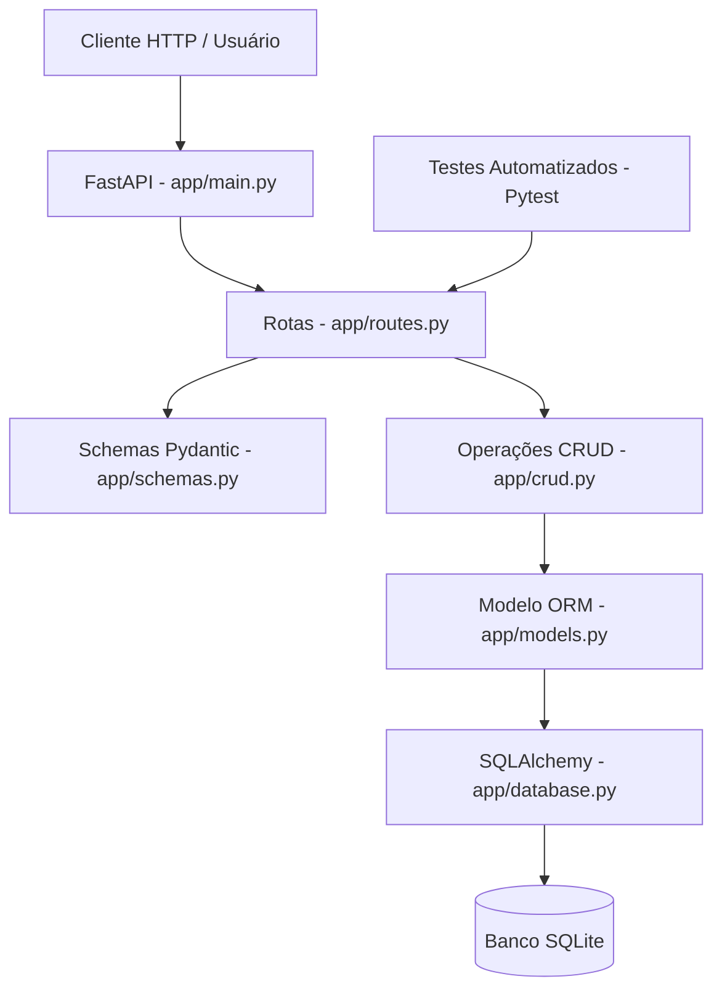

# Micro-API de Gerenciamento de Tarefas

## 1. Descrição do Projeto

A Micro-API de Gerenciamento de Tarefas é uma aplicação RESTful desenvolvida em Python com FastAPI, com o objetivo de permitir o gerenciamento simples de tarefas.

O projeto permite criar, listar, buscar, atualizar, concluir, excluir e filtrar tarefas por status e prioridade.

Este projeto foi desenvolvido como um MVP acadêmico, utilizando Inteligência Artificial Generativa como apoio no planejamento, estruturação, codificação, testes e documentação.

---

## 2. Objetivo

O objetivo principal do projeto é demonstrar o uso de IA generativa no ciclo de desenvolvimento de software, desde a concepção da arquitetura até a implementação e documentação de uma API funcional.

A aplicação busca seguir boas práticas de organização de código, versionamento com Git, documentação técnica e testes automatizados.

---

## 3. Funcionalidades

A API permite:

- Criar uma nova tarefa;
- Listar todas as tarefas;
- Buscar uma tarefa por ID;
- Atualizar os dados de uma tarefa;
- Marcar uma tarefa como concluída;
- Excluir uma tarefa;
- Filtrar tarefas por status;
- Filtrar tarefas por prioridade.

---

## 4. Tecnologias Utilizadas

- Python
- FastAPI
- Uvicorn
- SQLAlchemy
- SQLite
- Pydantic
- Pytest
- HTTPX
- Git
- GitHub

---

## 5. Estrutura do Projeto

```text
micro-api-tarefas-jn/
|-- app/
|   |-- __init__.py
|   |-- main.py
|   |-- database.py
|   |-- models.py
|   |-- schemas.py
|   |-- crud.py
|   `-- routes.py
|
|-- tests/
|   |-- __init__.py
|   `-- test_tarefas.py
|
|-- docs/
|   `-- arquitetura.md
|
|-- .gitignore
|-- requirements.txt
`-- README.md
```

---

## 6. Arquitetura da Solução

A aplicação foi organizada em camadas para separar responsabilidades:

- `main.py`: ponto de entrada da aplicação;
- `database.py`: configuração do banco SQLite e SQLAlchemy;
- `models.py`: definição do modelo ORM da tarefa;
- `schemas.py`: validação dos dados de entrada e saída com Pydantic;
- `crud.py`: operações de criação, leitura, atualização e exclusão;
- `routes.py`: definição dos endpoints da API;
- `tests/`: testes automatizados da aplicação.

A documentação completa da arquitetura está disponível em:

- `docs/arquitetura.md`

---

## 7. Diagrama de Fluxo



---

## 8. Como Executar o Projeto

### 8.1 Clonar o repositório

```bash
git clone https://github.com/joaonicholasfigueiredo/micro-api-tarefas-jn
cd micro-api-tarefas-jn
```

### 8.2 Criar o ambiente virtual

```bash
python -m venv .venv
```

### 8.3 Ativar o ambiente virtual

No Windows PowerShell:

```powershell
.\.venv\Scripts\Activate.ps1
```

No CMD:

```cmd
.venv\Scripts\activate.bat
```

### 8.4 Instalar as dependências

```bash
pip install -r requirements.txt
```

### 8.5 Executar a aplicação

```bash
uvicorn app.main:app --reload
```

A aplicação ficará disponível em:

- `http://127.0.0.1:8000`

A documentação interativa da API estará disponível em:

- `http://127.0.0.1:8000/docs`

---

## 9. Endpoints da API

| Método | Rota                       | Descrição                          |
| ------ | -------------------------- | ---------------------------------- |
| GET    | `/`                          | Verifica se a API está funcionando |
| POST   | `/tarefas/`                  | Cria uma nova tarefa               |
| GET    | `/tarefas/`                  | Lista todas as tarefas             |
| GET    | `/tarefas/{tarefa_id}`       | Busca uma tarefa por ID            |
| PUT    | `/tarefas/{tarefa_id}`       | Atualiza uma tarefa                |
| PATCH  | `/tarefas/{tarefa_id}/concluir` | Marca uma tarefa como concluída |
| DELETE | `/tarefas/{tarefa_id}`       | Exclui uma tarefa                  |

---

## 10. Exemplo de Criação de Tarefa

Requisição:

```json
{
  "titulo": "Estudar FastAPI",
  "descricao": "Criar uma micro-API com documentação e testes",
  "status": "pendente",
  "prioridade": "alta"
}
```

Resposta esperada:

```json
{
  "titulo": "Estudar FastAPI",
  "descricao": "Criar uma micro-API com documentação e testes",
  "status": "pendente",
  "prioridade": "alta",
  "id": 1,
  "data_criacao": "2026-04-28T19:00:00",
  "data_atualizacao": null,
  "data_conclusao": null
}
```

---

## 11. Status e Prioridades Permitidas

Status:

- `pendente`
- `em_andamento`
- `concluida`
- `cancelada`

Prioridade:

- `baixa`
- `media`
- `alta`

---

## 12. Como Executar os Testes

Para executar os testes automatizados, utilize:

```bash
pytest -v
```

Os testes validam os principais comportamentos da API, incluindo:

- rota inicial;
- criação de tarefa;
- listagem de tarefas;
- busca por ID;
- atualização;
- conclusão;
- exclusão;
- filtro por status.

---

## 13. Uso da Inteligência Artificial no Desenvolvimento

A Inteligência Artificial Generativa foi utilizada como apoio em diferentes etapas do projeto:

- definição do escopo do MVP;
- sugestão da arquitetura mínima;
- escolha das tecnologias;
- criação da estrutura de pastas;
- apoio na implementação dos módulos da API;
- geração de exemplos de testes automatizados;
- revisão da documentação;
- sugestão de mensagens de commit seguindo Conventional Commits;
- estruturação do README e da documentação técnica.

A IA atuou como uma ferramenta de apoio ao desenvolvimento, enquanto as decisões de escopo, validação, execução e organização foram conduzidas pelo desenvolvedor.

---

## 14. Versionamento

O projeto utiliza Git para controle de versão.

As mensagens de commit seguem o padrão Conventional Commits, por exemplo:

```text
feat(project): cria estrutura inicial da micro-api
feat(database): configura conexão com SQLite
feat(tasks): cria schemas de validacao de tarefas
feat(tasks): implementa operacoes CRUD de tarefas
feat(api): adiciona endpoints CRUD de tarefas
test(tasks): adiciona testes automatizados da API
docs(architecture): documenta arquitetura da micro-api
docs(readme): corrige formatacao da documentacao principal
```

---

## 15. Limitações e Próximos Passos

Por se tratar de um MVP acadêmico, algumas funcionalidades não foram implementadas nesta versão inicial.

Possíveis melhorias futuras:

- autenticação de usuários;
- relacionamento entre usuários e tarefas;
- paginação de resultados;
- filtros por data;
- interface frontend;
- deploy em nuvem;
- substituição do SQLite por PostgreSQL;
- integração com ferramentas externas de produtividade.

---

## 16. Autor

Projeto desenvolvido por João Nicholas como parte de uma atividade acadêmica sobre desenvolvimento de software assistido por Inteligência Artificial Generativa.

---

## 17. Licença

Este projeto é destinado para fins acadêmicos.