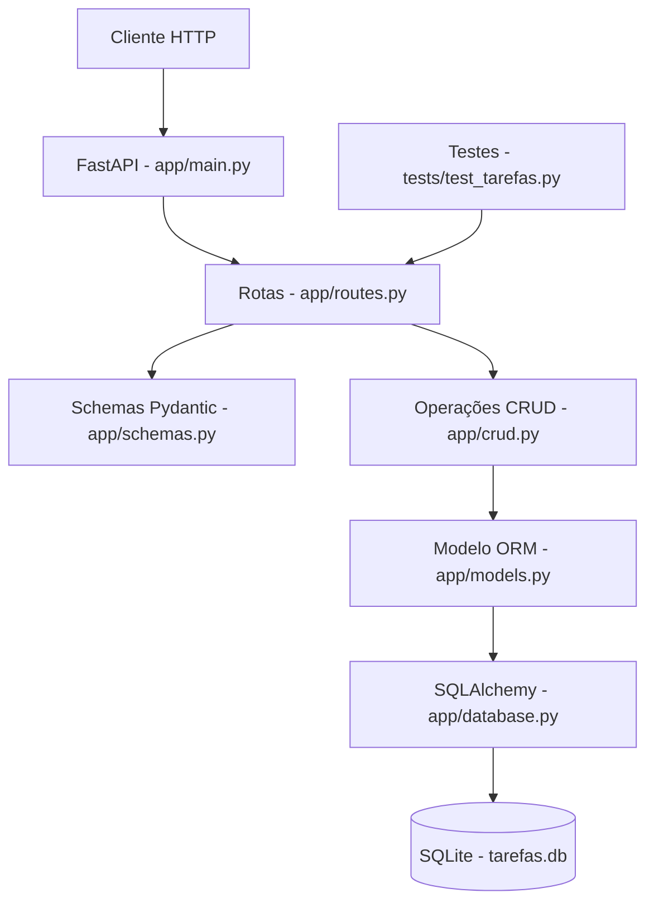

# Arquitetura da Micro-API de Gerenciamento de Tarefas

## 1. Visão geral

A **Micro-API de Gerenciamento de Tarefas** é uma aplicação **RESTful** desenvolvida em **Python** com **FastAPI**. O objetivo do projeto é permitir o **cadastro, consulta, atualização, conclusão, exclusão e filtragem** de tarefas.

Funcionalidades principais (endpoints):

- `GET /` (rota inicial de verificação)
- `POST /tarefas/` (criar tarefa)
- `GET /tarefas/` (listar tarefas, com filtros opcionais por `status_tarefa` e `prioridade`)
- `GET /tarefas/{tarefa_id}` (buscar por id)
- `PUT /tarefas/{tarefa_id}` (atualizar)
- `PATCH /tarefas/{tarefa_id}/concluir` (concluir)
- `DELETE /tarefas/{tarefa_id}` (excluir)

O projeto foi desenvolvido como um MVP simples e viável, priorizando organização do código, separação de responsabilidades, testes automatizados e documentação.

---

## 2. Tecnologias utilizadas

- Python
- FastAPI
- Uvicorn
- SQLAlchemy
- SQLite (arquivo `tarefas.db`)
- Pydantic
- Pytest
- HTTPX

---

## 3. Estrutura do projeto

```text
micro-api-tarefas-jn/
|-- app/
|   |-- __init__.py
|   |-- main.py
|   |-- database.py
|   |-- models.py
|   |-- schemas.py
|   |-- crud.py
|   `-- routes.py
|-- tests/
|   `-- test_tarefas.py
|-- docs/
|   `-- arquitetura.md
|-- requirements.txt
|-- tarefas.db
|-- .gitignore
`-- README.md
```

---

## 4. Responsabilidade dos arquivos

- `app/main.py`: cria a instância do FastAPI, cria as tabelas (`Base.metadata.create_all`) e registra as rotas.
- `app/database.py`: configura a conexão com SQLite (`sqlite:///./tarefas.db`), cria engine/sessão e disponibiliza a dependência `get_db`.
- `app/models.py`: define o modelo ORM `Tarefa` (tabela `tarefas`).
- `app/schemas.py`: define os schemas Pydantic e os tipos (`StatusTarefa` e `PrioridadeTarefa`) usados na validação.
- `app/crud.py`: implementa as operações de persistência (criar, listar, buscar, atualizar, concluir e excluir).
- `app/routes.py`: define os endpoints REST e liga as rotas às funções de `crud`.
- `tests/test_tarefas.py`: testes automatizados; sobrescreve `get_db` para usar SQLite em memória e isolar os casos de teste.

---

## 5. Fluxo de dados

O fluxo básico de uma requisição segue:

1. O cliente envia uma requisição HTTP para a API (rotas em `app/routes.py`).
2. O FastAPI valida os dados com os schemas Pydantic (`app/schemas.py`).
3. A rota injeta uma sessão do banco via dependência (`get_db`, em `app/database.py`).
4. A rota chama a função correspondente na camada CRUD (`app/crud.py`).
5. A camada CRUD consulta/persiste no banco via SQLAlchemy, usando o modelo ORM (`app/models.py`).
6. A API retorna a resposta em JSON.

---

## 6. Diagrama (Mermaid)



---

## 7. Decisões de arquitetura

- **FastAPI**: produtividade, validação automática, documentação interativa (Swagger/OpenAPI) e integração com Pydantic.
- **SQLite**: simplicidade e baixo custo operacional para um MVP.
- **Separação por módulos**: rotas, validação, persistência, modelo e configuração de banco ficam separados para facilitar manutenção.
- **Testes automatizados**: uso de banco em memória e override de dependência para evitar acoplamento ao `tarefas.db` real.

---

## 8. Possíveis evoluções futuras

- Adicionar autenticação/usuários e vínculo usuário-tarefa.
- Implementar paginação e ordenação na listagem.
- Adicionar filtros por datas (criação/atualização/conclusão).
- Criar interface frontend.
- Substituir SQLite por PostgreSQL.
- Publicar a API em ambiente de nuvem com CI/CD.
